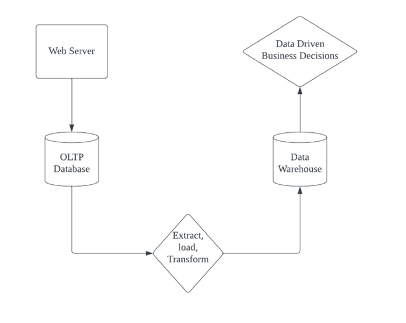
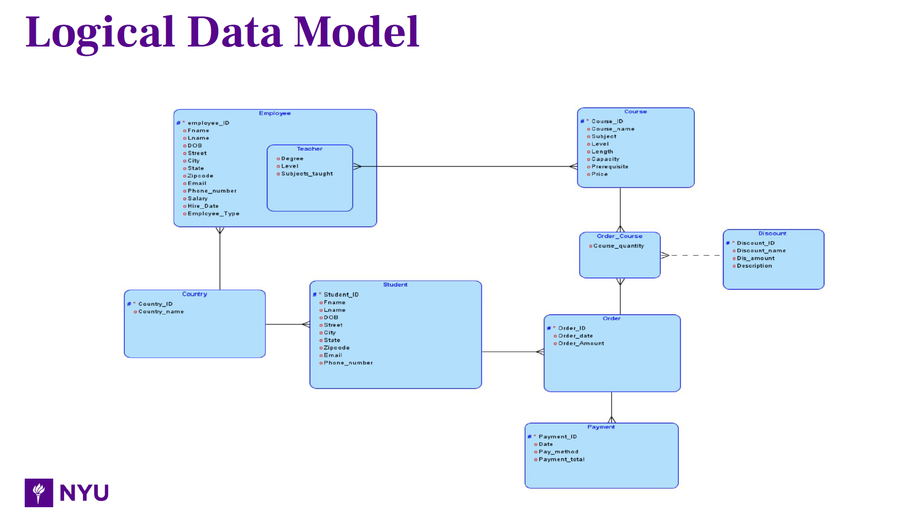
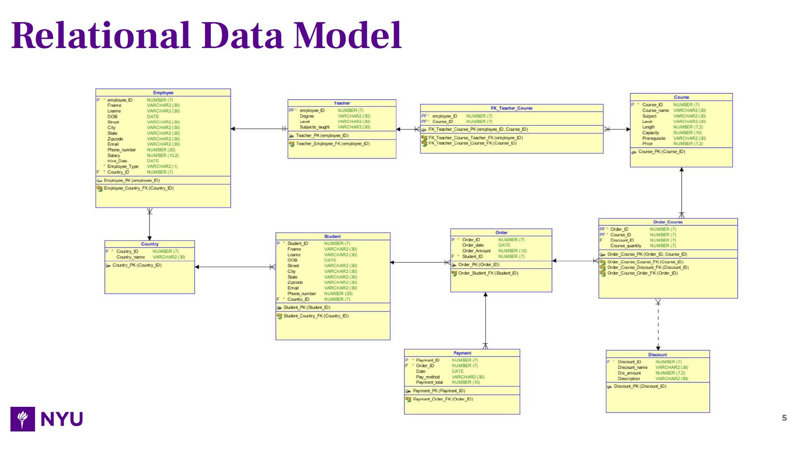

# Online Learning Platform OLTP Relational Database Design

## Executive Summary 

In this project, We are designing a OLTP relational database for an Educational company and automate the data flow. 

We are foucs on targeting two business problems in our database design. First, it's the scalability of RDBMS. Second, We want to implement discounts in your payment. We wish to transform our business into: 

## **Here is our Logical Data Model:**

## **Here is our Relational Data Model:**

**Here is the DDL SQL script:** [DDL.SQL](project_DDL.SQL) 